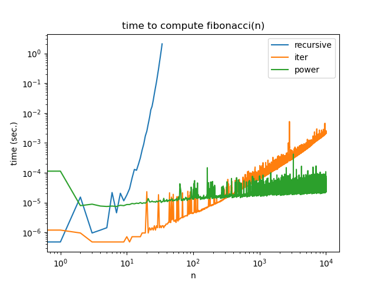

# Answers

Put any answers to questions in the assignment in this file, or any commentary you don't include in the code.

This is a markdown file (the `.md` extension gives it away). If you have never used markdown before, check out [this short guide](https://guides.github.com/features/mastering-markdown/).

## Problem 0
You don't need to say anything here.  Just complete [`fizzbuzz.py`](fizzbuzz.py).

## Problem 1

Number of additions is `floor(log2(n)) + #(n)`.  The function recurses `floor(log2(n))` times.
If the least significant bit is 0, there is 1 addition.  If the least significant bit is 1, there is an extra addition.

## Problem 2

`fibonacci_iter` should be faster - has O(n) time complexity and constant space complexity.  `fibonacci_recursive` has an exponential time and space complexity, although it suffices to say that it is obviously higher because we're doing a lot of redundant computation.

## Problem 3

Asymptotic number of operations is O(log2(n)) - which we can see from the answer to problem 1.  Note that multiplying two 2x2 matrices has a constant number of operations.

This is faster than either solution to problem 2.

There are potential numerical issues with floating point error or integer overflow (depending on what data type is used in the matrices).  There doesn't need to be any analysis of this.

## Problem 4

Note that the runtimes look like what we expect from above discussion.  If students make this plot first, it might help them out a bit.

## Feedback
